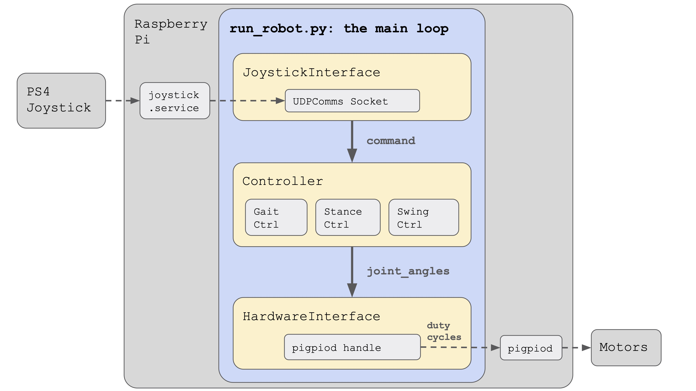
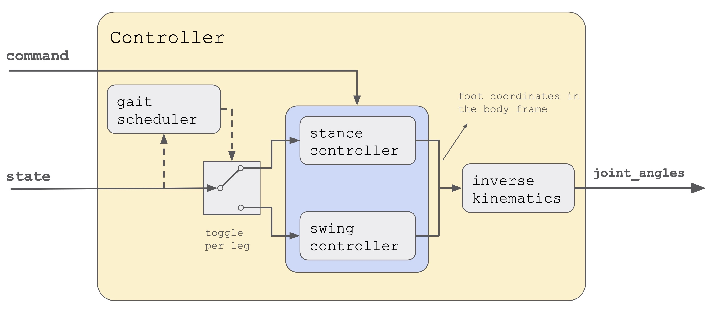

# Stanford Quadruped

## Overview
This repository hosts the code for Stanford Pupper and Stanford Woofer, Raspberry Pi-based quadruped robots that can trot, walk, and jump. 


Video of pupper in action: https://youtu.be/NIjodHA78UE

Link to project page: https://stanfordstudentrobotics.org/pupper

## How it works

The main program is ```run_robot.py``` which is located in this directory. The robot code is run as a loop, with a joystick interface, a controller, and a hardware interface orchestrating the behavior. 

The joystick interface is responsible for reading joystick inputs from a UDP socket and converting them into a generic robot ```command``` type. A separate program, ```joystick.py```, publishes these UDP messages, and is responsible for reading inputs from the PS4 controller over bluetooth. The controller does the bulk of the work, switching between states (trot, walk, rest, etc) and generating servo position targets. A detailed model of the controller is shown below. The third component of the code, the hardware interface, converts the position targets from the controller into PWM duty cycles, which it then passes to a Python binding to ```pigpiod```, which then generates PWM signals in software and sends these signals to the motors attached to the Raspberry Pi.

This diagram shows a breakdown of the robot controller. Inside, you can see four primary components: a gait scheduler (also called gait controller), a stance controller, a swing controller, and an inverse kinematics model. 

The gait scheduler is responsible for planning which feet should be on the ground (stance) and which should be moving forward to the next step (swing) at any given time. In a trot for example, the diagonal pairs of legs move in sync and take turns between stance and swing. As shown in the diagram, the gait scheduler can be thought of as a conductor for each leg, switching it between stance and swing as time progresses. 

The stance controller controls the feet on the ground, and is actually quite simple. It looks at the desired robot velocity, and then generates a body-relative target velocity for these stance feet that is in the opposite direction as the desired velocity. It also incorporates turning, in which case it rotates the feet relative to the body in the opposite direction as the desired body rotation. 

The swing controller picks up the feet that just finished their stance phase, and brings them to their next touchdown location. The touchdown locations are selected so that the foot moves the same distance forward in swing as it does backwards in stance. For example, if in stance phase the feet move backwards at -0.4m/s (to achieve a body velocity of +0.4m/s) and the stance phase is 0.5 seconds long, then we know the feet will have moved backwards -0.20m. The swing controller will then move the feet forwards 0.20m to put the foot back in its starting place. You can imagine that if the swing controller only put the leg forward 0.15m, then every step the foot would lag more and more behind the body by -0.05m. 

Both the stance and swing controllers generate target positions for the feet in cartesian coordinates relative the body center of mass. It's convenient to work in cartesian coordinates for the stance and swing planning, but we now need to convert them to motor angles. This is done by using an inverse kinematics model, which maps between cartesian body coordinates and motor angles. These motor angles, also called joint angles, are then populated into the ```state``` variable and returned by the model. 


## Installation
### Materials
- Raspberry Pi 4
- SD Card (32GB recommended)
- Raspberry Pi 4 power supply (USB-C, 5V, >=3A)
- Ethernet cable

### Steps
1. Set up the Raspberry Pi
    - Follow the instructions on this repo to put the self-setup code on the Pi: https://github.com/stanfordroboticsclub/RPI-Setup
    - If you're not on Stanford campus, use 
        ```bash
        sudo raspi-config
        ```
        to connect the Raspberry Pi to your home wifi network. It's important to connect to the internet over wifi and leave your ethernet port unused. This is because our UDPComms library checks that the ethernet adapter has a certain ip and subnet mask so it can do inter-process and inter-device communication.
    - Note: The robot code won't work without following the RPI-Setup instructions linked above because the robot's inter-process communication layer (UDPComms) needs the Pi to have a certain ethernet configuration. If you're having problems with the networking, specifically with UDPComms failing, check out this issue: https://groups.google.com/forum/#!topic/stanford-quadrupeds/GO5GPiBUcnc
2. Test that the Pi works and connects to the internet
    ```bash
    ping www.google.com
    ```
    - If that doesn't work, do
    ```bash
    ifconfig
    ```
    and check the wlan0 portion to check if you have an IP address and other debugging info. 
3. (Optional) Install the PREEMPT-RT kernel onto the Pi
    - Download the kernel patch https://github.com/lemariva/RT-Tools-RPi/tree/master/preempt-rt/kernel_4_19_59-rt23-v7l%2B
    - Follow these instructions starting from “Transfer the Kernel” https://lemariva.com/blog/2019/09/raspberry-pi-4b-preempt-rt-kernel-419y-performance-test
    - Test by running in the shell:
        ```bash
        uname -r
        ```
    - We haven't yet characterized the benefits of using the preempt-rt kernel on the Pi so skipping it is totally fine.
4. Clone this code
    ```bash
    git clone https://github.com/stanfordroboticsclub/StanfordQuadruped.git
    ```
5. Install requirements
    ```bash
    cd StanfordQuadruped
    sudo bash install.sh
    ```
6. Power-cycle the robot
7. Reconnect to the robot (over ethernet) and check that everything is running correctly. (If your computer can't connect to the Pi, check that you correctly changed your computer's ethernet adapter's IP and subnet mask as described in step 1). 
    - SSH into the robot
        ```bash
        ssh pi@10.0.0.xx
        ```
        where xx is the address you chose.
    - Check the status for the joystick service 
        ```bash
        sudo systemctl status joystick
        ```
        - If you haven't yet connected the PS4 controller, it should say something like:
            ```shell
            pi@pupper(rw):~/StanfordQuadruped$ sudo systemctl status joystick
            ● joystick.service - Pupper Joystick service
            Loaded: loaded (/home/pi/PupperCommand/joystick.service; enabled; vendor preset: enabled)
            Active: active (running) since Sun 2020-03-01 06:57:20 GMT; 1s ago
            Main PID: 5692 (python3)
                Tasks: 3 (limit: 4035)
            Memory: 7.1M
            CGroup: /system.slice/joystick.service
                    ├─5692 /usr/bin/python3 /home/pi/PupperCommand/joystick.py
                    └─5708 hcitool scan --flush

            Mar 01 06:57:20 pupper systemd[1]: Started Pupper Joystick service.
            Mar 01 06:57:21 pupper python3[5692]: [info][controller 1] Created devices /dev/input/js0 (joystick) /dev/input/event0 (evdev)
            Mar 01 06:57:21 pupper python3[5692]: [info][bluetooth] Scanning for devices
            ```
    - Connect the PS4 controller to the Pi by putting it pairing mode.
        - To put it into pairing mode, hold the share button and circular Playstation button at the same time until it starts making quick double flashes. 
        - If it starts making slow single flashes, hold the Playstation button down until it stops blinking and try again.
    - Once the controller is connected, check the status again 
        ```bash
        sudo systemctl status joystick
        ```
        - It should now look something like
            ```shell
            pi@pupper(rw):~/StanfordQuadruped$ sudo systemctl status joystick
            ● joystick.service - Pupper Joystick service
            Loaded: loaded (/home/pi/PupperCommand/joystick.service; enabled; vendor preset: enabled)
            Active: active (running) since Sun 2020-03-01 06:57:20 GMT; 55s ago
            Main PID: 5692 (python3)
                Tasks: 2 (limit: 4035)
            Memory: 7.3M
            CGroup: /system.slice/joystick.service
                    └─5692 /usr/bin/python3 /home/pi/PupperCommand/joystick.py

            Mar 01 06:57:20 pupper systemd[1]: Started Pupper Joystick service.
            Mar 01 06:57:21 pupper python3[5692]: [info][controller 1] Created devices /dev/input/js0 (joystick) /dev/input/event0 (evdev)
            Mar 01 06:57:21 pupper python3[5692]: [info][bluetooth] Scanning for devices
            Mar 01 06:58:12 pupper python3[5692]: [info][bluetooth] Found device A0:AB:51:33:B5:A0
            Mar 01 06:58:13 pupper python3[5692]: [info][controller 1] Connected to Bluetooth Controller (A0:AB:51:33:B5:A0)
            Mar 01 06:58:14 pupper python3[5692]: running
            Mar 01 06:58:14 pupper python3[5692]: [info][controller 1] Battery: 50%
            ```shell
    - Check the status of the robot service
        ```bash
        sudo systemctl status robot
        ```
        - The output varies depending on the order of you running various programs, but just check that it doesn't have any red text saying that it failed.
        - If it did fail, usually this fixes it
            ```bash
            sudo systemctl restart robot
            ```
## Calibration
Calibration is a necessary step before running the robot because that we don't yet have a precise measurement of how the servos arms are fixed relative to the servo output shafts. Running the calibration script will help you determine this rotational offset by prompting you to align each of the 12 degrees of freedom with a known angle, such as the horizontal or the vertical. 
### Materials
1. Finished robot
2. Some sort of stand to hold the robot up so that its legs can extend without touching the ground/table. 
### Steps
1. Plug in your 2S Lipo battery
2. SSH into the robot as done in the installation section
3. Stop the robot script from taking over the PWM outputs
    ```bash
    rw
    sudo systemctl stop robot
    ```
4. Run the calibration script
    ```bash
    cd StanfordQudruped
    sudo pigpiod
    python3 calibrate_servos.py
    ```
    - The calibration script will prompt you through calibrating each of pupper's 12 servo motors. When it asks you to move a link to the horizontal position, you might be wondering what exactly counts as making the link horizontal. The answer is to align the *joint centers* of each link. For example, when aligning the upper link to the horizontal, you'll want to the line between the servo spline and bolt that connects the upper link to the lower link to be as horizontal as possible. 
5. Re-enable the robot script
    ```bash
    sudo systemctl start robot
    ```

## Running the robot
1. Plug in your 2S Lipo battery. 
    - If you followed the instructions above, the code will automatically start running on boot. If you want to turn this feature off, ssh into the robot, go into rw mode, and then do
        ```bash
        sudo systemctl disable robot
        ```
2. Connect the PS4 controller to the Pi by putting it pairing mode.
    - To put it into pairing mode, hold the share button and circular Playstation button at the same time until it starts making quick double flashes. 
    - If it starts making slow single flashes, hold the Playstation button down until it stops blinking and try again.
3. Wait until the controller binds to the robot, at which point the controller should turn a dim green (or whatever color you chose in pupper/HardwareConfig.py for the deactivated color). 
4. Press L1 on the controller to "activate" the robot. The controller should turn bright green (or again, whatever you chose in HardwareConfig).
5. You're good to go! Check out the controls section below for operating instructions.

## Robot controls
- L1: toggles activating and deactivate the robot
    - Note: the PS4 controller's front light will change colors to indicate if the robot is deactivated or activated.
- R1: pressing it transitions the robot between Rest mode and Trot mode
- "x" button: Press it three times to complete a full hop
- Right joystick
    - Forward/back: pitches the robot forward and backward
    - Left/right: turns the robot left and right
- Left joystick
    - Forward/back: moves the robot forward/backwards when in Trot mode
    - Left/right: moves the robot left/right when in Trot mode

## Notes
- PS4 controller pairing instructions (repeat of instructions above)
    - To put it into pairing mode, hold the share button and circular Playstation button at the same time until it starts making quick double flashes. 
    - If it starts making slow single flashes, hold the Playstation button down until it stops blinking and try again.
- Battery voltage
    - If you power the robot with anything higher than 8.4V (aka >2S) you'll almost certainly fry all your expensive servos!
    - Also note that you should attach a lipo battery alarm to your battery when running the robot so that you are know when the battery is depleted. Discharging your battery too much runs the risk of starting a fire, especially if you try to charge it again after it's been completely discharged. A good rule-of-thumb for know when a lipo is discharged is checking whether the individual cell voltages are below 3.6V.
- Feet!
    - Using the bare carbon fiber as feet works well for grippy surfaces, including carpet. If you want to use the robot on a more slippery surface, we recommend buying rubber grommets (McMaster #90131A101) and fastening them to the pre-drilled holes in the feet. 

## Help
- Feel free to raise an issue (https://github.com/stanfordroboticsclub/StanfordQuadruped/issues/new/choose) or email me at nathankau [at] stanford [dot] edu
- We also have a Google group set up here: https://groups.google.com/forum/#!forum/stanford-quadrupeds


